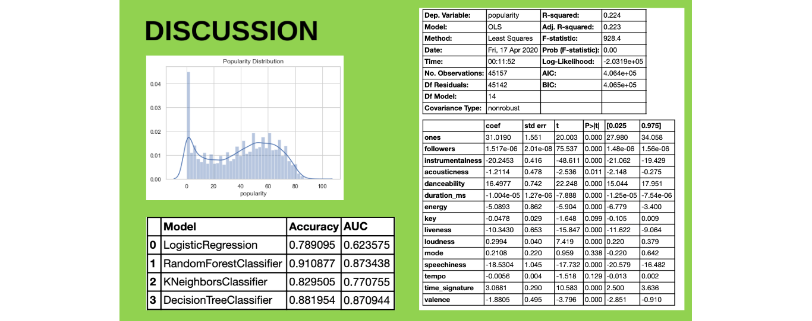

### Final Project - Predicting Spotify Song Popularity

This project has the objective of displaying the relationship between song data - audio features from the Spotify database - and song popularity measured by the number of streams a song has on Spotify.

Some of the questions we tried to answer are:
* What does it take to get a popular song on Spotify?
* Can a song's features predict its popularity on Spotify?

**Data and Analysis**

From the Spotify database API, a ~45,000 songs and artist were analyzed from different genres. The dataset comes from Million Song Database (2008-2010) and Kaggle Datasets. There were three different calls to the API to get artist, audio and track features.

After using Python and some data wrangling techniques, we created data frame that was used to do some exploratory data analysis. Our Target Variable is Popularity and the Independent Variables are:
Acousticness, Danceability, Duration, Energy, Instrumentalness, Key, Liveness, Loudness, Mode, Speechiness, Tempo, Valence and
Followers.

Looking at the distributions of each feature, there is no clear correlation between the popularity of a song, and other features.
The only features that show some correlation are loudness, acousticness and energy.

**Modeling**

We used classification algorithms to predict whether a song will be popular or not. We used historical data to train the  model and built a prediction model by regression. The 3 models we used are: Linesr Regression, OLS Regression and Classification Model.

We can conclude that our results suggest that audio features from Spotify have little to moderate impact in predicting song popularity.

More Info:  [Prezi Presentation](https://prezi.com/view/6GrxZQ6CnhMpSGklysZ1/)
